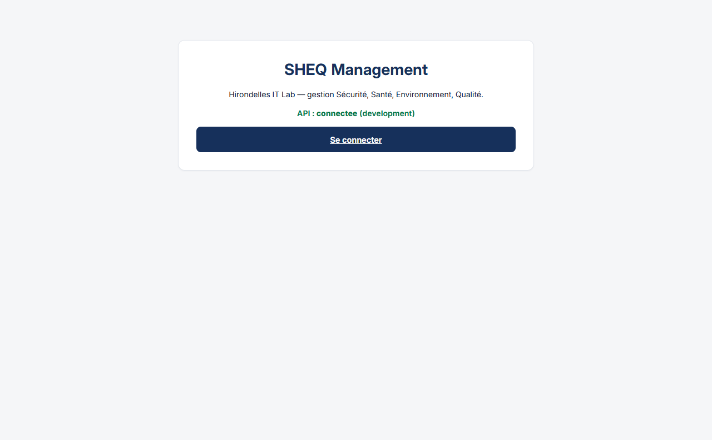
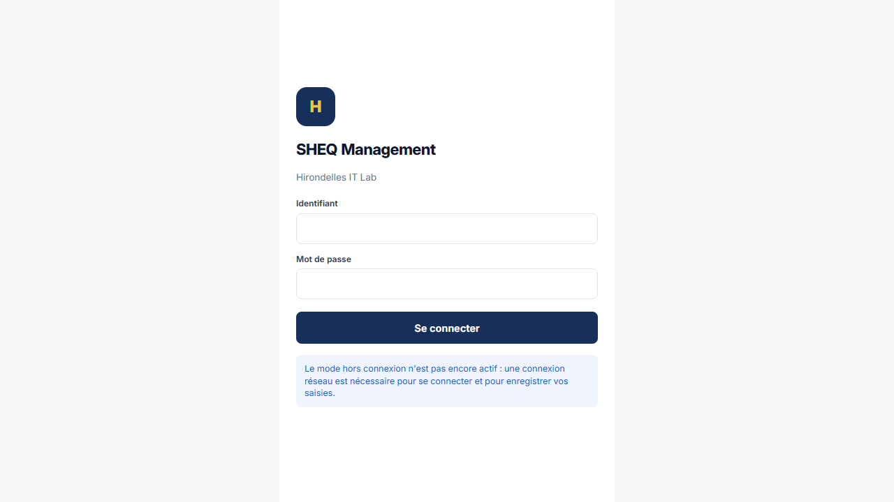
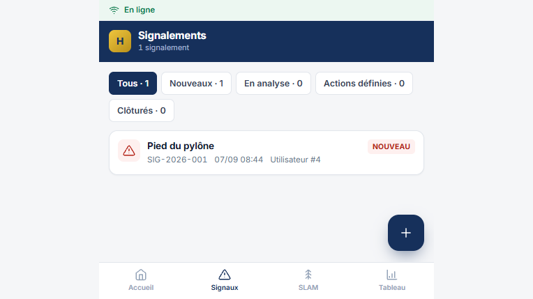
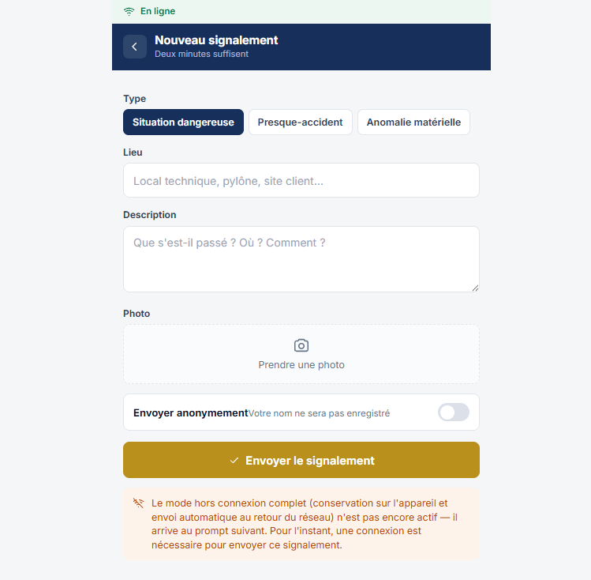
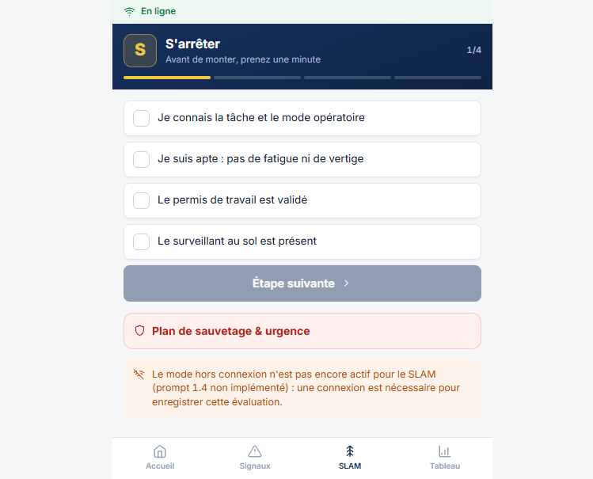
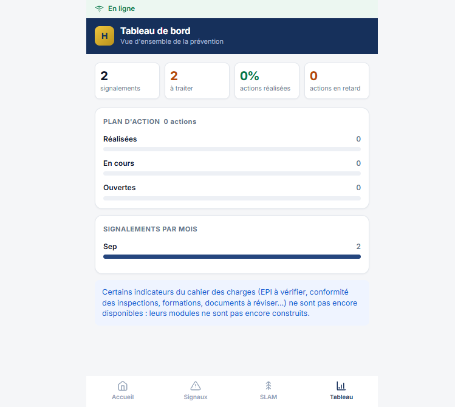
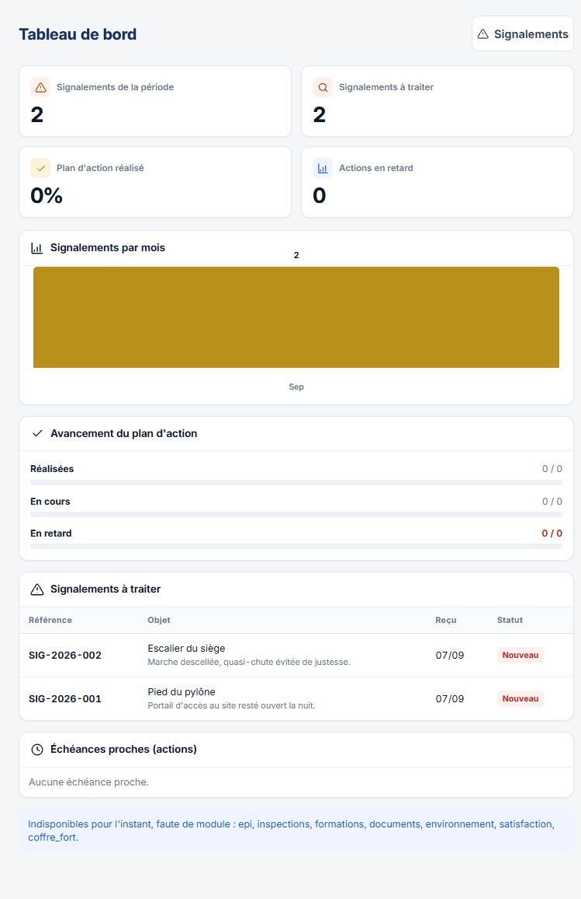
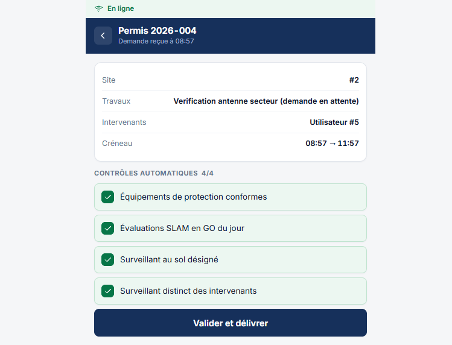
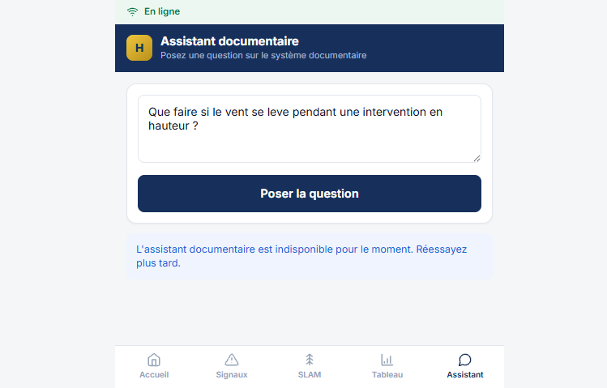
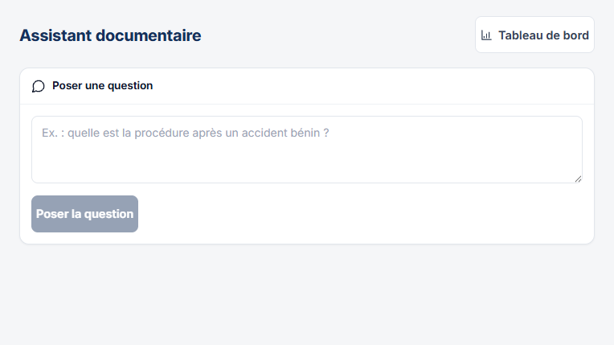

# Manuel utilisateur — SHEQ Management

Hirondelles IT Lab — système de gestion Sécurité, Santé, Environnement, Qualité.

> **État de ce manuel (prompt 5.3, mis à jour au prompt 6.2)** : l'écran actuel de
> l'application ne couvre que 6 des 20 modules métier construits côté serveur, plus
> l'assistant documentaire ajouté au lot 6 (chapitre 16 du CDC). Ce manuel documente
> fidèlement ce qui existe aujourd'hui, avec des captures d'écran réelles. Les modules
> qui n'ont pas encore d'écran sont listés en fin de document plutôt que passés sous
> silence — voir [« Modules sans interface pour l'instant »](#modules-sans-interface-pour-linstant).

## Se connecter

Ouvrez l'application dans un navigateur. L'écran d'accueil affiche l'état de la
connexion à l'API et un bouton « Se connecter ».

Saisissez votre identifiant et votre mot de passe (fournis par l'administrateur).

**Important — mode hors connexion** : contrairement à ce que prévoit le cahier des
charges pour le terrain (techniciens sur pylônes, souvent sans réseau), le mode hors
connexion n'est pas encore actif. Une connexion réseau est nécessaire pour se
connecter et pour enregistrer toute saisie (signalement, SLAM). L'application vous en
avertit directement sur les écrans concernés.

Une fois connecté, quatre raccourcis apparaissent en bas d'écran : **Accueil**,
**Signaux**, **SLAM**, **Tableau** (ce dernier n'apparaît que si votre rôle y donne
accès — voir plus bas).

---

## Technicien

*Comptes de démonstration : voir `backend/scripts/donnees_demo.py` — identifiants
`a.kone` et `s.diallo`.*

### Signalements

L'écran **Signaux** liste vos signalements, avec des onglets pour filtrer par statut
(Nouveaux, En analyse, Actions définies, Clôturés).

Le bouton **+** ouvre le formulaire de nouveau signalement : type (situation
dangereuse / presque-accident / anomalie matérielle), lieu, description, photo
optionnelle, et une case « Envoyer anonymement » — dans ce cas votre nom n'est
enregistré nulle part, y compris dans les journaux techniques.

*Un technicien ou un collaborateur ne voit que ses propres signalements dans cette
liste (hors signalements anonymes, invisibles à tous sauf au référent SHEQ et à
l'administrateur) ; les autres rôles voient l'ensemble.*

### SLAM (Sécurité au Levage et à la Manutention)

L'écran **SLAM** fait dérouler les 4 étapes du contrôle avant intervention. Chaque
étape doit être entièrement cochée pour passer à la suivante. Une décision **GO** en
fin de parcours est la condition pour que vous puissiez figurer comme intervenant sur
un permis de travail ; une décision **NO GO** s'enregistre avec un motif obligatoire,
sans bloquer votre activité.

### Demande de permis de travail

La demande de permis se fait aujourd'hui uniquement via l'API (`POST /api/v1/permis`
— voir la documentation interactive sur `/docs`) : aucun formulaire n'existe encore
côté écran mobile. Une fois la demande enregistrée, elle suit le même circuit que
celle créée depuis l'écran de validation ci-dessous.

---

## Collaborateur

Mêmes écrans **Signaux** et **Nouveau signalement** que le technicien. Pas d'accès au
tableau de bord ni à la validation de permis (hors périmètre de ce rôle, voir CLAUDE.md
point 6).

---

## Référent SHEQ / Responsable / Administrateur

*Comptes de démonstration : `o.diarra` (référent SHEQ), `f.traore` (responsable),
`a.traore` (administrateur).*

### Tableau de bord

Deux présentations existent pour le même indicateur : une version mobile
(`/tableau-de-bord`) et une version desktop plus dense (`/gestion/tableau-de-bord`),
accessible aux rôles administrateur, référent SHEQ et responsable uniquement (le
tableau de bord agrège des signalements que certains rôles ne peuvent pas consulter
individuellement, y compris les anonymes).

Le tableau de bord affiche lui-même un avertissement honnête : les indicateurs des
modules sans écran (EPI à vérifier, conformité des inspections, formations,
documents à réviser…) n'y figurent pas encore.

### Validation des permis de travail (responsable, administrateur)

Depuis un lien direct vers `/permis/{id}/validation` (partagé par le technicien
demandeur, ou consulté via l'API pour retrouver l'identifiant), le responsable voit
les 4 contrôles automatiques de la règle de blocage et leur résultat individuel, puis
valide ou refuse.

*Limite actuelle : il n'existe pas encore d'écran listant les permis en attente de
validation — le lien direct est le seul chemin aujourd'hui.*

### Traitement des signalements (référent SHEQ, administrateur)

Le référent SHEQ voit tous les signalements dans l'écran **Signaux**, y compris les
anonymes. Changer le statut d'un signalement (passer « en analyse », rattacher une
action) se fait uniquement via l'API pour l'instant (`PATCH
/api/v1/signalements/{id}/statut`) : aucun écran de traitement n'existe encore.

### Gestion des utilisateurs (administrateur)

Aucun écran : la création d'un compte se fait via l'API
(`POST /api/v1/auth/utilisateurs`, voir `/docs`). Il n'existe par ailleurs **aucune
route**, écran ou non, pour désactiver un compte existant — voir la revue de sécurité
(prompt 5.2, `docs/JOURNAL.md`) qui a déjà signalé ce manque.

---

### Assistant documentaire (lot 6, tout profil)

Ouvert à tout utilisateur authentifié, sur mobile (`/assistant`, cinquième
onglet) et sur desktop (`/gestion/assistant`, lien depuis le tableau de
bord). Répond en langage naturel à une question portant sur le système
documentaire, en s'appuyant exclusivement sur les documents en vigueur, avec
leurs références (cliquables : elles ouvrent le fichier du document).

**Fonction désactivée par défaut** : `ASSISTANCE_ACTIVEE` et
`ASSISTANCE_ASSISTANT_DOCUMENTAIRE_ACTIVE` valent `false` tant que la
direction n'a pas validé un budget (chapitre 16.6 du CDC) — les captures
ci-dessus montrent l'état « indisponible », honnête sur le fait qu'aucune clé
n'est configurée dans cet environnement de démonstration. Une fois activée et
des documents indexés (à l'approbation d'une nouvelle version), l'assistant
répond avec citations, ou indique explicitement que la documentation ne
permet pas de répondre.

## Modules sans interface pour l'instant

Les modules suivants ont une API complète, testée, et fonctionnelle (utilisable dès
aujourd'hui via `/docs` par un utilisateur technique), mais **aucun écran** dans
l'application : risques, EPI, équipements (parc), fiches de configuration,
inspections, formations (compétences, habilitations, séances, quiz), audits internes,
revues de direction, documents (SMI), visiteurs, déchets, enquêtes de satisfaction,
actions correctives, notifications.

Cet écart entre un backend étendu (14 modules livrés sur les lots 1 à 5) et un
frontend qui n'en couvre que 6 est le constat le plus important de ce manuel — voir le
détail dans le bilan de fin de projet.

## Limites connues côté écran

- **Identifiants bruts affichés** : plusieurs écrans (liste des signalements, écran
  de validation d'un permis) affichent `Utilisateur #4` ou `Site #2` au lieu du nom
  réel — le frontend ne résout pas encore les identifiants en libellés lisibles.
- **Aucun test automatisé côté frontend** : Vitest est dans la pile technique prévue
  (CLAUDE.md, point 3) mais aucun fichier de test n'existe encore pour les 8 vues
  livrées.
- **Mode hors connexion** : non implémenté (prompt 1.4), un avertissement explicite
  en informe l'utilisateur sur les écrans concernés plutôt que de le lui cacher.
